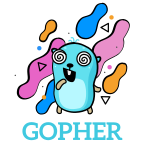
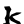
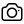
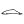
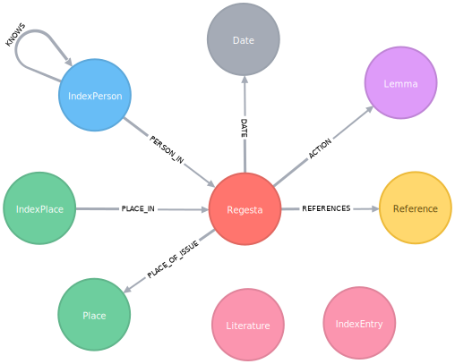

# SVGym

SVG optimization that goes **beyond SVGO** — deterministic-first, with an optional AI mode.

SVGym applies a routed pipeline of ~40 small transforms (distilled from LLM rollouts) and **verifies every step**. It renders the SVG before and after each change, computes SSIM/PSNR, and reverts any step that doesn't help or drops visual quality below threshold (the conservative level keeps SSIM ≥ 0.99). The result is output that's smaller, never broken.

Where SVGO applies a fixed plugin list to every file, SVGym profiles each file and adapts.

## Showcase

▶ **[Live interactive demo](https://maziars.github.io/svgym/)** — before/after across the full demo set (activates once GitHub Pages is enabled for this repo).

A few deterministic-pipeline results (sizes vs the raw original and vs SVGO):

| Example | Preview | Original | SVGO | SVGym | Saved |
|---|---|---|---|---|---|
| Free Gophers #9 |  | 363.1 KB | 249.8 KB | 70.2 KB | **81%** |
| Iran Lion & Sun flag |  | 112.6 KB | 76.3 KB | 30.1 KB | **73%** |
| Glyph (k) |  | 4.2 KB | 1.2 KB | 785 B | **82%** |
| Heroicons camera |  | 726 B | 669 B | 570 B | **21%** |
| OpenMoji dragon |  | 3.8 KB | 2.2 KB | 1.7 KB | **55%** |
| Whale sketch |  | 5.1 KB | 1.4 KB | 981 B | **81%** |
| Neo4j diagram |  | 8.3 KB | 5.1 KB | 3.0 KB | **64%** |

"Saved" is reduction vs the original; the visual output is unchanged (SSIM ≥ 0.99). SVGO failed outright on some inputs (e.g. `tux`) that SVGym handles.

## Why

SVGO is the ubiquitous baseline and a great tool, but it applies the same fixed rules to everything. SVGym goes further per-file, and it's safe because of the verification gate.

On a 43-file benchmark (icons, glyphs, flags, emoji, illustrations, charts, sketches), SVGym's deterministic pipeline reduces size by ~30% beyond SVGO on the typical file (~35% size-weighted), holding SSIM ≥ 0.99. An optional AI mode adds a few more points on the hardest files; notably, the deterministic pipeline alone captures ~86% of what the AI mode achieves — so most users never need the AI.

These are benchmark figures on that file set, not guarantees.

## How it works

The **deterministic pipeline** runs several ordered stages — structural cleanup, path simplification, merging, coordinate rounding, and more. Each tool is gated by a render-and-compare verifier: keep the change if it helped and stayed within SSIM/PSNR bounds, otherwise revert.

The optional **AI fallback** is invoked only when the deterministic result leaves savings on the table. The model proposes edits that pass the exact same verifier.

## Install

Requires Python ≥ 3.10.

Core (deterministic):

```bash
pip install -e .
```

This installs lxml, numpy, cairosvg, pillow, and scikit-image. Rendering is required because the pipeline verifies via SSIM.

AI mode (optional):

```bash
pip install -e .[ai]
```

Then put a key in a `.env` at the repo root:

```bash
ANTHROPIC_API_KEY=...        # or GEMINI_API_KEY=...
SVGYM_PROVIDER=anthropic     # or gemini
```

### Optional external tool

The `run_svgo` step shells out to Node's `svgo` if it's on your PATH:

```bash
npm i -g svgo
```

Without it the pipeline still runs — it just skips that one baseline step.

### macOS note

cairosvg needs the native Cairo library. If you hit a `libcairo` import error:

```bash
brew install cairo
```

## CLI usage

Single file:

```bash
svgym optimize icon.svg          # writes icon.min.svg
```

Flags:

- `-o out.svg` — output path
- `--level conservative|aggressive|lossless` — default `conservative`
- `--ai` — enable the AI fallback (needs a key)
- `-q` — quiet

A folder / pack (cross-file analysis + optional sprite sheet):

```bash
svgym pack ./icons/ -o ./dist/
```

Flags: `--level`, `--no-sprite`, `--json report.json`.

## Library usage

```python
from svgym.deterministic import optimize_svg_deterministic

result = optimize_svg_deterministic(open("icon.svg").read(), level="conservative")
print(result["compression_pct"], result["ssim"])
open("icon.min.svg", "w").write(result["optimized_svg"])
```

The AI hybrid (needs an API key):

```python
from svgym.hybrid import optimize_svg_hybrid
```

## Repo layout

- `svgym/` — the library + CLI (deterministic pipeline, AI optimizer, tools).
- `docs/` — a static showcase page (open `docs/index.html`; deployable to GitHub Pages) with before/after comparisons across the demo set.
- `demo/` — the benchmark SVGs and precomputed results used by the showcase.
- `tests/` — tests.

## Attributions (demo SVGs)

- Heroicons (MIT, Tailwind Labs)
- Phosphor Icons (MIT)
- Flag Icons (MIT)
- Lion & Sun flag (Public Domain)
- Free Gophers Pack (CC0, MariaLetta)
- SVG Spinners (MIT, Utkarsh Verma)
- W3C SVG WG samples (W3C Document License)
- Twemoji (CC-BY 4.0)
- OpenMoji (CC-BY-SA 4.0)

Brand logos/trademarks belong to their owners.

## License

SVGym is released under the [MIT License](LICENSE).
